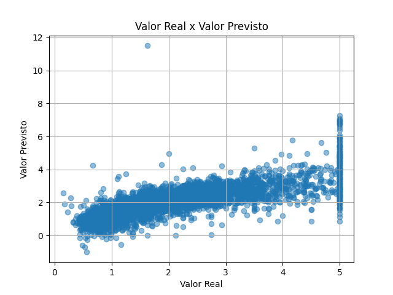

# 🏠 Previsão de Preços de Casas com Regressão Linear

Este projeto demonstra o uso de Machine Learning para prever o valor médio de casas na Califórnia usando regressão linear.

## 🚀 Objetivos

- Criar um modelo de IA supervisionado
- Utilizar dados reais
- Avaliar o modelo com métricas simples
- Exibir os resultados com gráficos

## 📁 Estrutura do Projeto

predict-house-prices/
├── data/ # Dados (vazio neste projeto)
├── notebooks/ # Notebook exploratório
├── src/ # Código Python com modelo
├── outputs/ # Gráficos gerados

## 📊 Tecnologias Utilizadas

- Python
- Pandas, NumPy
- Matplotlib, Seaborn
- Scikit-learn

## ▶️ Como executar

1. Clone este repositório:
git clone https://github.com/marcoweb76/predict-house-prices.git
cd predict-house-prices

2. Instale as dependências:
pip install -r requirements.txt

3. Execute:
- O notebook em `notebooks/01_modelo_linear.ipynb`
- Ou o script: `python src/train_model.py`

## 📈 Exemplo de resultado

## 📜 Licença

Este projeto está sob a licença MIT.
